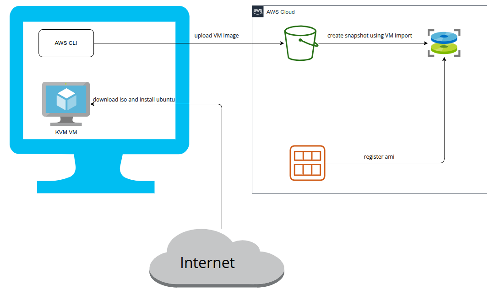

# ISO to AMI Project



---

## Project Overview
This project contains a bash script that automates the process of:
1. Downloading an Ubuntu server ISO file.
2. Installing the ISO on a local virtual machine using KVM.
3. Uploading the resulting image to AWS and converting it into an Amazon Machine Image (AMI).

---

## Pre-Requisites
Before running the script, ensure the following:

1. **Operating System**:
   - A Linux-based OS is required.

2. **Virtualization Support**:
   - Ensure your CPU supports virtualization (check with `egrep -c '(vmx|svm)' /proc/cpuinfo`).
   - Enable virtualization in your system BIOS/UEFI settings.

3. **AWS Account Requirements**:
   - **S3 Bucket**: Create an S3 bucket in your AWS account to store the VM image.
   - **AWS CLI**: Configure the AWS CLI on your local machine with the appropriate permissions for S3 and EC2 services.
     - Ensure the CLI is configured with `aws configure`.
   - **VM Import Service Role**: Set up the `vmimport` service role in your AWS account. Refer to the AWS documentation: [VM Import Service Role](https://docs.aws.amazon.com/vm-import/latest/userguide/required-permissions.html#vmimport-role).

4. **Python**:
   - Python 3 is required for the internal HTTP server used in the script.

---

## Essential KVM Tools
Install the following KVM tools and dependencies to ensure the script works as expected:

1. **qemu-kvm**: Provides the KVM hypervisor.
2. **libvirt**: Daemon and CLI tools to manage VMs.
3. **bridge-utils**: Networking tools for creating virtual bridges.
4. **cloud-utils**: Tools to interact with cloud-init-based images.

### Install All Dependencies with a Single Command:
For Ubuntu/Debian-based systems, run:
```bash
sudo apt update && sudo apt install -y qemu-kvm libvirt-daemon-system libvirt-clients bridge-utils cloud-utils python3

### How does it work?

1. Clone the project to your local computer
2. Fill your values within the config.env file
3. Run the script after make it executable
